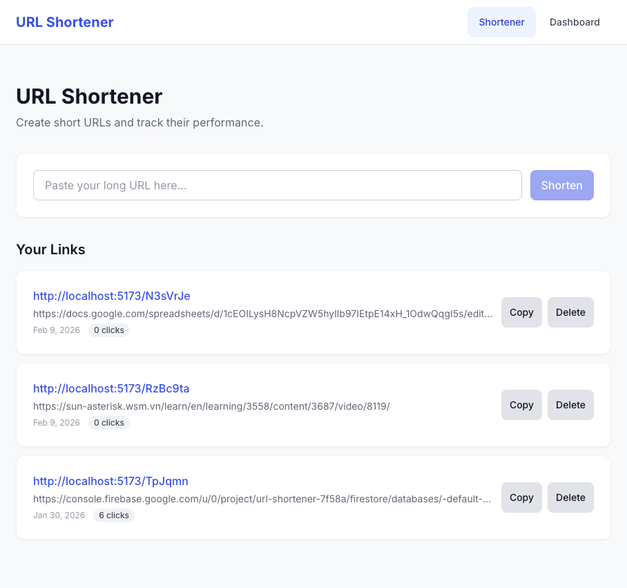

# URL Shortener with Click Analytics

A single-page application for shortening URLs and tracking click analytics, built with React, TypeScript, and Firebase.

## Features

- **Create Short URLs** — Paste a long URL, get a short link, copy to clipboard
- **Click Tracking** — Every short URL visit records timestamp, referrer source, and device type
- **Analytics Dashboard** — Summary cards, daily/weekly trend charts, top links table
- **Per-Link Detail** — Drill into individual link analytics with referrer & device breakdowns (pie charts)
- **Link Management** — View, copy, and delete your shortened URLs
- **GA4 Integration** — Page views and key user actions tracked via Firebase Analytics

## Screenshots

| Home Page                                    | Dashboard                                    | Link Detail |
| -------------------------------------------- | -------------------------------------------- | ----------- |
|  |  |

> Add your screenshots to `docs/screenshots/` — recommended size: 1280×800px.

## Tech Stack

| Layer     | Technology                            |
| --------- | ------------------------------------- |
| Frontend  | React 18, TypeScript 5 (strict), Vite |
| Styling   | Tailwind CSS v3 (mobile-first)        |
| Charts    | Recharts                              |
| Backend   | Firebase Cloud Functions (Node.js 20) |
| Database  | Cloud Firestore                       |
| Analytics | Firebase Analytics / GA4              |
| Hosting   | Firebase Hosting                      |

## Prerequisites

- **Node.js** ≥ 20
- **npm** ≥ 10
- **Firebase CLI** — `npm install -g firebase-tools`
- **Firebase Project** on the [Blaze plan](https://firebase.google.com/pricing) (required for Cloud Functions)

## Getting Started

### 1. Clone & Install

```bash
git clone https://github.com/tanbpv-1625/url-shortener.git
cd url-shortener
npm install
cd functions && npm install && cd ..
```

### 2. Configure Environment

```bash
cp .env.example .env
```

Fill in your Firebase project credentials in `.env`:

```dotenv
VITE_FIREBASE_API_KEY=your-api-key
VITE_FIREBASE_AUTH_DOMAIN=your-project.firebaseapp.com
VITE_FIREBASE_PROJECT_ID=your-project-id
VITE_FIREBASE_STORAGE_BUCKET=your-project.appspot.com
VITE_FIREBASE_MESSAGING_SENDER_ID=your-sender-id
VITE_FIREBASE_APP_ID=your-app-id
VITE_GA_MEASUREMENT_ID=your-measurement-id
VITE_BASE_URL=http://localhost:5000
```

### 3. Firebase Setup

```bash
firebase login
firebase use --add   # Select your project
firebase deploy --only firestore:rules,firestore:indexes
```

### 4. Run Development Server

```bash
# SPA dev server (http://localhost:5173)
npm run dev

# Cloud Functions emulator (for redirect + click tracking)
cd functions && npm run serve
```

> **Note**: In dev mode, visiting `http://localhost:5173/:shortCode` uses a client-side redirect page. In production, Firebase Hosting rewrites route short codes to the Cloud Function for server-side 302 redirects.

## Scripts

| Command                 | Description                       |
| ----------------------- | --------------------------------- |
| `npm run dev`           | Start Vite dev server             |
| `npm run build`         | Type-check + production build     |
| `npm run preview`       | Preview production build locally  |
| `npm run typecheck`     | Run TypeScript compiler (no emit) |
| `npm run lint`          | ESLint with zero warnings policy  |
| `npm run format`        | Format all files with Prettier    |
| `npm run format:check`  | Check formatting without writing  |
| `npm run test`          | Run tests with Vitest             |
| `npm run test:watch`    | Run tests in watch mode           |
| `npm run test:coverage` | Run tests with coverage report    |

## Project Structure

```
├── src/
│   ├── App.tsx                 # Router + page view tracker
│   ├── main.tsx                # Entry point
│   ├── lib/                    # Firebase init, GA4 helpers, utils
│   ├── types/                  # ShortUrl, ClickEvent, AsyncState<T>
│   ├── services/               # Firestore data access layer
│   ├── hooks/                  # useShortUrl, useDashboard, useAnalytics
│   ├── components/
│   │   ├── common/             # Button, Input, Card, Loading, Toast, EmptyState, ErrorBoundary
│   │   ├── layout/             # Navbar, PageLayout, MobileNav
│   │   ├── url/                # UrlForm, UrlList, UrlCard
│   │   ├── analytics/          # ClickChart, ReferrerBreakdown, DeviceBreakdown
│   │   └── dashboard/          # StatsOverview, TrendChart, TopLinksTable, SourceDeviceOverview
│   ├── pages/                  # HomePage, DashboardPage, LinkDetailPage, NotFoundPage, RedirectPage
│   └── styles/                 # Tailwind globals
├── functions/                  # Cloud Function: redirect + click tracking
├── firebase.json               # Hosting rewrites, Firestore config
├── firestore.rules             # Security rules
├── firestore.indexes.json      # Composite indexes
└── specs/                      # Feature specifications & task tracking
```

## Deployment

```bash
# Build SPA
npm run build

# Deploy everything (Hosting + Functions + Firestore rules/indexes)
firebase deploy

# Or deploy individually
firebase deploy --only hosting
firebase deploy --only functions
firebase deploy --only firestore:rules,firestore:indexes
```

## Architecture

- **Shortener Page** (`/`) — Create short URLs, view & manage link list
- **Dashboard** (`/dashboard`) — Aggregate analytics: stats cards, trend chart, top links, source/device pie charts
- **Link Detail** (`/link/:shortCode`) — Per-link click trend, referrer & device breakdowns
- **Redirect** — Cloud Function handles `GET /:shortCode` → 302 redirect + click event recording with referrer categorization and device detection (ua-parser-js v1.x)

Data flows directly from the React app to Firestore via the client SDK. The only server-side component is the redirect Cloud Function.

## License

ISC

## License

Phan Van Tan B
