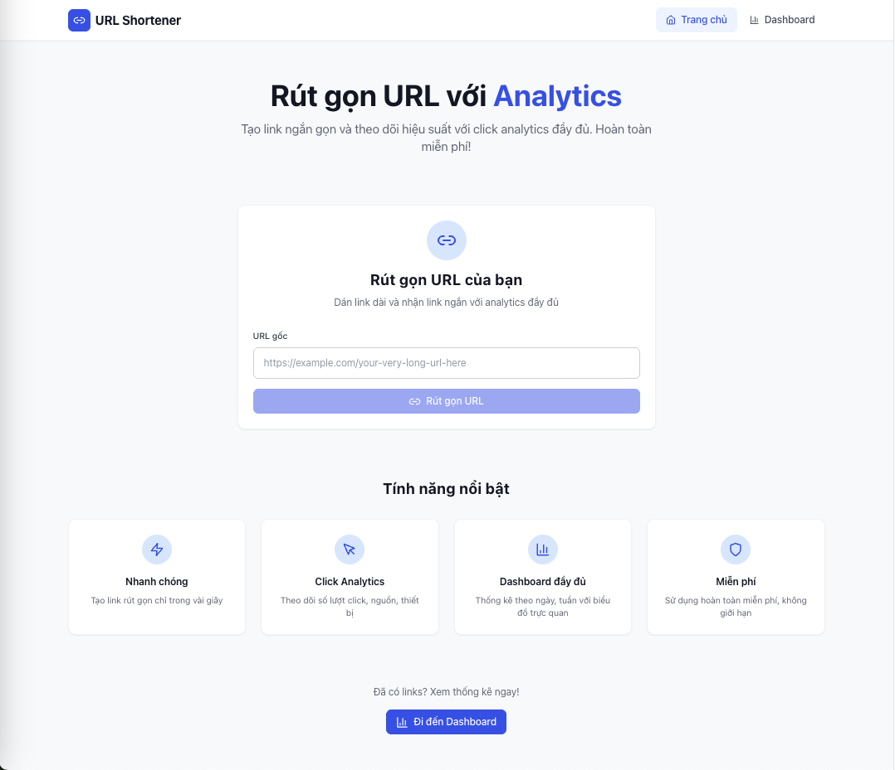
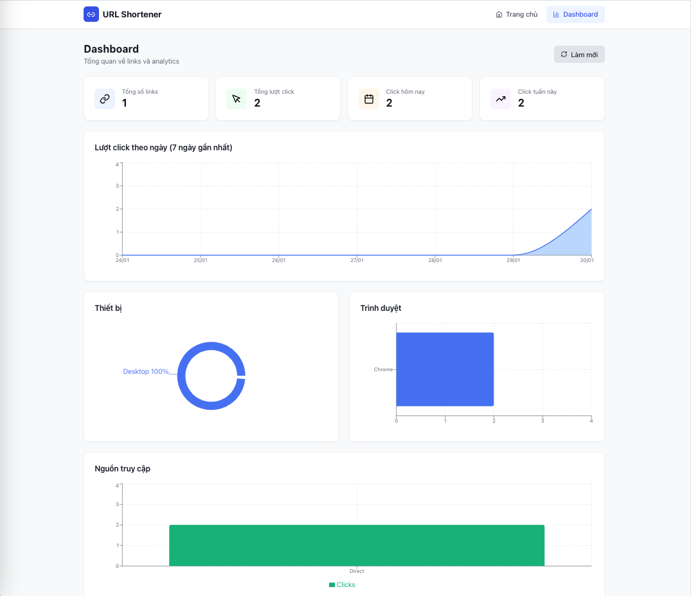
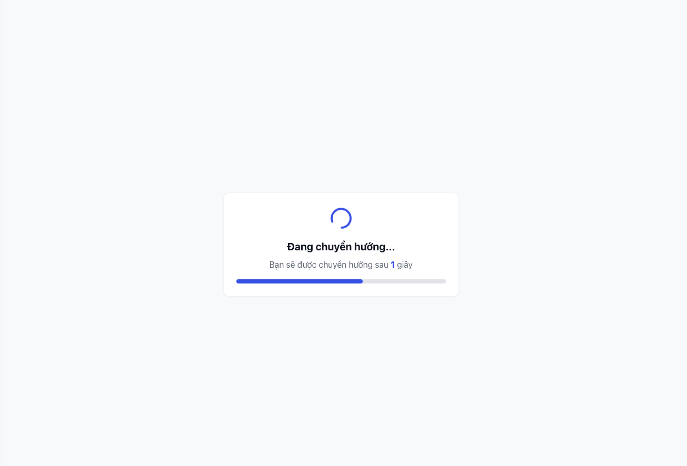

# 🔗 URL Shortener - Dịch vụ rút gọn URL với Click Analytics


Ứng dụng web rút gọn URL với tính năng theo dõi click analytics đầy đủ. Được xây dựng với React, TypeScript, Firebase và Google Analytics 4.

## 📸 Screenshots

### Trang chủ - Tạo link rút gọn



_Giao diện trang chủ cho phép người dùng nhập URL dài và tạo link rút gọn_

### Dashboard - Tổng quan thống kê



_Dashboard hiển thị tổng quan về các links và thống kê click_

### Biểu đồ Analytics


_Biểu đồ thống kê theo ngày, thiết bị, trình duyệt và nguồn truy cập_

### Chi tiết Link


_Trang chi tiết hiển thị analytics cho từng link cụ thể_

### Trang chuyển hướng



_Trang chuyển hướng với countdown trước khi redirect đến URL gốc_

---

## ✨ Tính năng

### 🔗 Rút gọn URL

- Tạo link rút gọn từ URL dài chỉ với 1 click
- Short code 6 ký tự ngẫu nhiên, an toàn
- Copy link nhanh chóng
- Hỗ trợ tất cả URL hợp lệ (http/https)

### 📊 Click Analytics

- **Theo dõi số lượt click** real-time
- **Phân tích thiết bị**: Desktop, Mobile, Tablet
- **Phân tích trình duyệt**: Chrome, Firefox, Safari, Edge...
- **Phân tích hệ điều hành**: Windows, macOS, iOS, Android, Linux
- **Theo dõi nguồn truy cập** (referrer)
- **Thống kê theo thời gian**: Hôm nay, tuần này, 7 ngày gần nhất

### 📈 Dashboard

- **Thống kê tổng quan**: Tổng links, tổng clicks, clicks hôm nay, clicks tuần này
- **Biểu đồ trực quan**:
  - Line chart: Clicks theo ngày
  - Pie chart: Phân bố thiết bị
  - Bar chart: Top trình duyệt
  - Bar chart: Top nguồn truy cập
- **Bảng quản lý links**: Xem, copy, xóa links

### 🔄 Tích hợp Google Analytics 4

- Track page views
- Track link creation events
- Track link click events
- Phân tích nâng cao với GA4

---

## 🛠️ Tech Stack

| Category          | Technology                 |
| ----------------- | -------------------------- |
| **Frontend**      | React 18, TypeScript, Vite |
| **Styling**       | TailwindCSS                |
| **Database**      | Firebase Firestore         |
| **Hosting**       | Firebase Hosting           |
| **Analytics**     | Google Analytics 4         |
| **Charts**        | Recharts                   |
| **Icons**         | Lucide React               |
| **Routing**       | React Router v6            |
| **Notifications** | React Hot Toast            |
| **Date Utils**    | date-fns                   |
| **ID Generation** | nanoid                     |

---

## 🚀 Cài đặt và Chạy

### Yêu cầu

- Node.js 18+
- npm hoặc yarn
- Tài khoản Firebase (miễn phí)
- Tài khoản Google Analytics (miễn phí)

### Bước 1: Clone repository

```bash
git clone https://github.com/your-username/url-shortener.git
cd url-shortener
```

### Bước 2: Cài đặt dependencies

```bash
pnpm install
```

### Bước 3: Tạo Firebase Project

1. Truy cập [Firebase Console](https://console.firebase.google.com/)
2. Tạo project mới
3. Enable **Firestore Database** (chọn production mode)
4. Vào Project Settings > General > Your apps > Thêm Web app
5. Copy Firebase config

### Bước 4: Tạo Google Analytics 4 Property

1. Truy cập [Google Analytics](https://analytics.google.com/)
2. Tạo Property mới (GA4)
3. Lấy Measurement ID (dạng G-XXXXXXXXXX)

### Bước 5: Cấu hình Environment Variables

Tạo file `.env` từ template:

```bash
cp .env.example .env
```

Cập nhật các giá trị:

```env
VITE_FIREBASE_API_KEY=your_api_key
VITE_FIREBASE_AUTH_DOMAIN=your_project.firebaseapp.com
VITE_FIREBASE_PROJECT_ID=your_project_id
VITE_FIREBASE_STORAGE_BUCKET=your_project.appspot.com
VITE_FIREBASE_MESSAGING_SENDER_ID=your_sender_id
VITE_FIREBASE_APP_ID=your_app_id
VITE_GA_MEASUREMENT_ID=G-XXXXXXXXXX
VITE_APP_URL=http://localhost:5173
```

### Bước 6: Chạy Development Server

```bash
pnpm dev
```

Truy cập: http://localhost:5173

---

## 📦 Deploy lên Firebase Hosting

### Bước 1: Cài đặt Firebase CLI

```bash
npm install -g firebase-tools
```

### Bước 2: Đăng nhập Firebase

```bash
firebase login
```

### Bước 3: Khởi tạo Firebase (nếu chưa)

```bash
firebase init
```

Chọn:

- Hosting (Configure files for Firebase Hosting)
- Firestore (Set up Firestore Security Rules)

### Bước 4: Build và Deploy

```bash
pnpm build
firebase deploy
```

Sau khi deploy, cập nhật `VITE_APP_URL` trong `.env` với URL production.

---

## 📁 Cấu trúc Project

```
url-shortener/
├── public/
│   └── favicon.svg
├── src/
│   ├── components/
│   │   ├── AnalyticsCharts.tsx    # Biểu đồ analytics
│   │   ├── Layout.tsx             # Layout chung
│   │   ├── LinksTable.tsx         # Bảng danh sách links
│   │   ├── StatsCards.tsx         # Cards thống kê
│   │   └── UrlShortenerForm.tsx   # Form tạo short URL
│   ├── lib/
│   │   ├── analytics.ts           # Google Analytics utils
│   │   ├── firebase.ts            # Firebase config
│   │   └── urlService.ts          # Firebase CRUD operations
│   ├── pages/
│   │   ├── DashboardPage.tsx      # Trang Dashboard
│   │   ├── HomePage.tsx           # Trang chủ
│   │   ├── LinkDetailPage.tsx     # Chi tiết link
│   │   └── RedirectPage.tsx       # Trang redirect
│   ├── types/
│   │   └── index.ts               # TypeScript interfaces
│   ├── App.tsx                    # App routing
│   ├── index.css                  # Global styles
│   ├── main.tsx                   # Entry point
│   └── vite-env.d.ts              # Vite types
├── docs/
│   └── screenshots/               # Screenshots cho README
├── .env.example                   # Template environment variables
├── .gitignore
├── firebase.json                  # Firebase config
├── firestore.rules               # Firestore security rules
├── firestore.indexes.json        # Firestore indexes
├── index.html
├── package.json
├── postcss.config.js
├── tailwind.config.js
├── tsconfig.json
└── vite.config.ts
```

---

## 🔐 Firestore Data Structure

### Collection: `urls`

```json
{
  "id": "auto-generated",
  "shortCode": "abc123",
  "originalUrl": "https://example.com/very-long-url",
  "createdAt": "Timestamp",
  "clickCount": 42,
  "isActive": true
}
```

### Collection: `clicks`

```json
{
  "id": "auto-generated",
  "urlId": "url-document-id",
  "shortCode": "abc123",
  "timestamp": "Timestamp",
  "referrer": "https://google.com",
  "userAgent": "Mozilla/5.0...",
  "device": "mobile",
  "browser": "Chrome",
  "os": "Android"
}
```

---

## 🔧 Customization

### Thay đổi độ dài Short Code

Trong file `src/lib/urlService.ts`:

```typescript
// Thay đổi số 6 thành độ dài mong muốn
const nanoid = customAlphabet('abcdefghijklmnopqrstuvwxyzABCDEFGHIJKLMNOPQRSTUVWXYZ0123456789', 6)
```

### Thay đổi thời gian countdown redirect

Trong file `src/pages/RedirectPage.tsx`:

```typescript
const [countdown, setCountdown] = useState(3) // Thay đổi số 3
```

### Thêm Firestore Security Rules cho Production

Cập nhật `firestore.rules` để bảo mật hơn:

```javascript
rules_version = '2';
service cloud.firestore {
  match /databases/{database}/documents {
    match /urls/{urlId} {
      allow read: if true;
      allow create: if request.resource.data.keys().hasAll(['shortCode', 'originalUrl', 'createdAt', 'clickCount', 'isActive']);
      allow update: if request.resource.data.diff(resource.data).affectedKeys().hasOnly(['clickCount', 'isActive']);
      allow delete: if true;
    }

    match /clicks/{clickId} {
      allow read: if true;
      allow create: if request.resource.data.keys().hasAll(['urlId', 'shortCode', 'timestamp', 'referrer', 'userAgent', 'device', 'browser', 'os']);
    }
  }
}
```

---

## 📊 Google Analytics Events

Ứng dụng tự động track các events sau:

| Event Category | Event Action | Description              |
| -------------- | ------------ | ------------------------ |
| Link           | Create       | Khi tạo link mới         |
| Link           | Click        | Khi click vào short link |
| Link           | Redirect     | Khi redirect đến URL gốc |

---

## 🆓 Chi phí

| Service            | Free Tier                     | Đủ cho                        |
| ------------------ | ----------------------------- | ----------------------------- |
| Firebase Firestore | 50K reads/day, 20K writes/day | ~1,000 links, ~50K clicks/day |
| Firebase Hosting   | 10GB storage, 360MB/day       | Unlimited for small app       |
| Google Analytics 4 | Unlimited                     | Unlimited                     |

**Tổng chi phí: $0/tháng** cho dự án nhỏ và vừa.

---

## 🤝 Contributing

1. Fork repository
2. Tạo feature branch (`git checkout -b feature/amazing-feature`)
3. Commit changes (`git commit -m 'Add some amazing feature'`)
4. Push to branch (`git push origin feature/amazing-feature`)
5. Mở Pull Request

---

## 📝 License

MIT License - Xem file [LICENSE](LICENSE) để biết thêm chi tiết.

---

## 👤 Author

**Your Name**

- GitHub: [@your-username](https://github.com/your-username)

---

## ⭐ Show your support

Hãy cho project một ⭐ nếu bạn thấy hữu ích!
